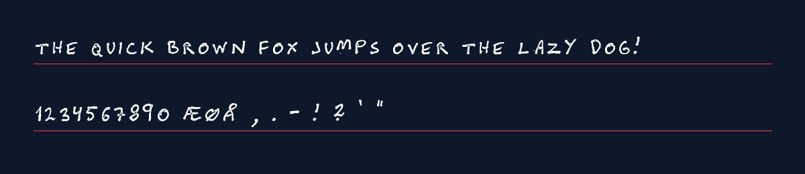
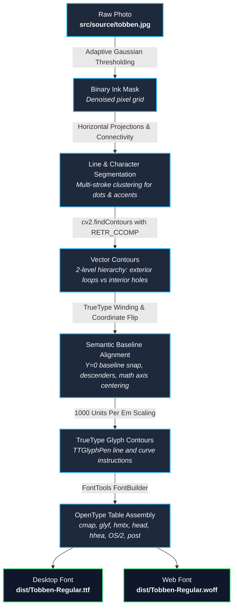
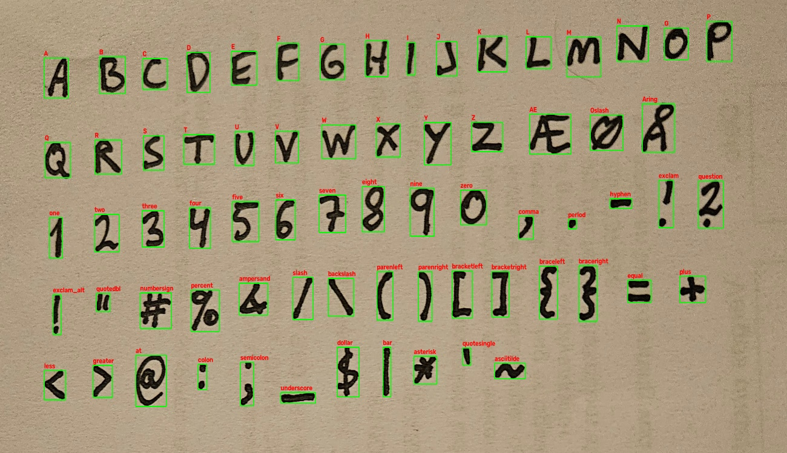

# Tobben Regular (v0.2)

A handmade, authentic display font compiled directly from physical ink-on-paper handwriting using an open-source Python computer vision and typography pipeline.



---

## 📦 What's in the Box?

- **`dist/Tobben-Regular.ttf`**: Desktop TrueType font (ready to install on Windows, macOS, and Linux).
- **`dist/Tobben-Regular.woff`**: Compressed Web Open Font Format (ready to deploy to websites).
- **`preview/index.html`**: Interactive live specimen and typewriter sandbox.
- **`src/source/tobben.jpg`**: Original high-resolution handwritten source sheet.
- **`src/build.py`**: Pure Python compiler pipeline that converts the source image into vector font tables.

---

## 🗂️ Character Coverage (71 Glyphs)

| Category | Glyphs Included |
| :--- | :--- |
| **Uppercase Letters** | `A B C D E F G H I J K L M N O P Q R S T U V W X Y Z` |
| **Scandinavian Vowels** | `Æ Ø Å` |
| **Lowercase Mapping** | `a`–`z`, `æ`, `ø`, `å` (automatically mapped to uppercase glyphs) |
| **Digits** | `0 1 2 3 4 5 6 7 8 9` |
| **Punctuation** | `, . - ! ? ' " : ; _` |
| **Enclosures & Slashes** | `( ) [ ] { } / \` |
| **Math & Symbols** | `+ = < > @ # % & $ \| * ~` |

---

## 🚀 Installation & Usage

### Desktop (Windows / macOS)
- **Windows**: Right-click [`dist/Tobben-Regular.ttf`](dist/Tobben-Regular.ttf) and select **Install** (or **Install for all users**).
- **macOS**: Double-click `dist/Tobben-Regular.ttf` and click **Install Font** in Font Book.

### Web (`@font-face`)
```css
@font-face {
  font-family: 'Tobben';
  src: url('dist/Tobben-Regular.woff') format('woff'),
       url('dist/Tobben-Regular.ttf') format('truetype');
  font-weight: normal;
  font-style: normal;
}

body {
  font-family: 'Tobben', sans-serif;
}
```

---

## 🛠️ Building From Source

### 1. Requirements
Install the required Python libraries using `pip`:
```bash
pip install -r requirements.txt
```

### 2. Compile the Font
Run the build script from the repository root:
```bash
python src/build.py
```
This reads `src/source/tobben.jpg`, extracts the contours, anchors glyphs to the baseline, and updates `dist/Tobben-Regular.ttf` and `dist/Tobben-Regular.woff`.

### 3. Test in the Browser
Open `preview/index.html` in any web browser to type test words and inspect the glyph specimen grid.

---

## 📐 Pipeline Architecture




